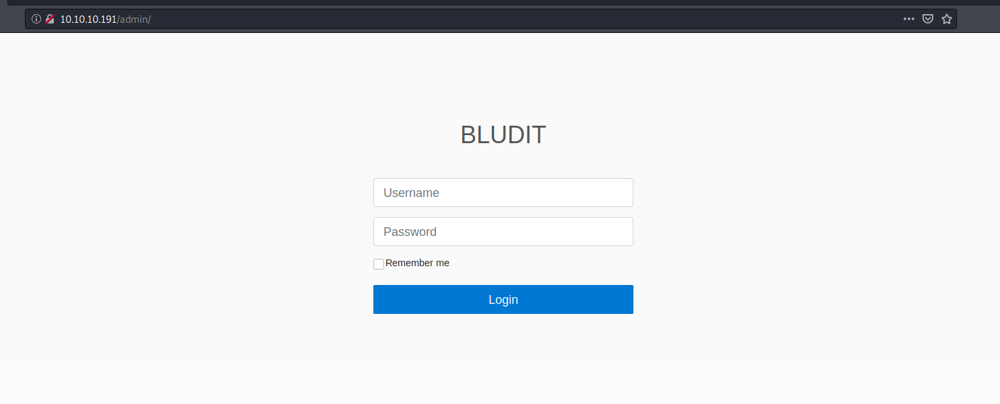
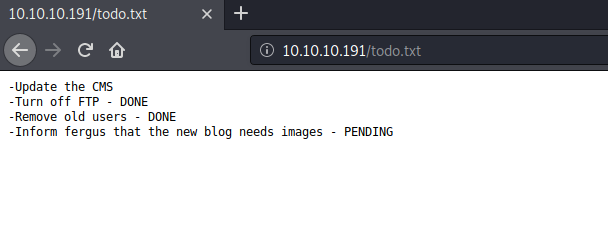

Blunder

This is a write-up for Blunder provided by HackTheBox.

The given IP address for this machine is 10.10.10.191

## Enumeration

Using nmap, I began the enumeration process to see which ports are open/closed on this IP.
```
nmap -sC -sV -p- 10.10.10.191
```

### Output: 
```
Starting Nmap 7.80 ( https://nmap.org ) at 2020-09-05 14:44 EDT
Nmap scan report for 10.10.10.191
Host is up (0.058s latency).
Not shown: 65533 filtered ports
PORT   STATE  SERVICE VERSION
21/tcp closed ftp
80/tcp open   http    Apache httpd 2.4.41 ((Ubuntu))
|_http-generator: Blunder
|_http-server-header: Apache/2.4.41 (Ubuntu)
|_http-title: Blunder | A blunder of interesting facts

Service detection performed. Please report any incorrect results at https://nmap.org/submit/ .
Nmap done: 1 IP address (1 host up) scanned in 116.10 seconds
```

We can see that port 21 has been closed for FTP and port 80 is open and running an Apache service (2.4.41) along with an http generator called Blunder. 

From here, we can navigate to http://10.10.10.191 to see exactly what the Apache service is running.

A page is loaded that seems to be a blog about intersting facts.


We can continue to manually navigate around the website or we can use another enumeration tool to enumerate this site's linked directories.
```
gobuster dir -u http://10.10.10.191 -w /usr/share/wordlists/dirb/common.txt -x txt,php,py,cgi
```

### Output:
```
===============================================================
Gobuster v3.0.1
by OJ Reeves (@TheColonial) & Christian Mehlmauer (@_FireFart_)
===============================================================
[+] Url:            http://10.10.10.191
[+] Threads:        10
[+] Wordlist:       /usr/share/wordlists/dirb/common.txt
[+] Status codes:   200,204,301,302,307,401,403
[+] User Agent:     gobuster/3.0.1
[+] Extensions:     php,py,cgi,txt
[+] Timeout:        10s
===============================================================
2020/09/05 14:56:13 Starting gobuster
===============================================================
/.hta (Status: 403)
/.hta.txt (Status: 403)
/.hta.php (Status: 403)
/.hta.py (Status: 403)
/.hta.cgi (Status: 403)
/.htaccess (Status: 403)
/.htaccess.txt (Status: 403)
/.htaccess.php (Status: 403)
/.htaccess.py (Status: 403)
/.htaccess.cgi (Status: 403)
/.htpasswd (Status: 403)
/.htpasswd.txt (Status: 403)
/.htpasswd.php (Status: 403)
/.htpasswd.py (Status: 403)
/.htpasswd.cgi (Status: 403)
/0 (Status: 200)
/about (Status: 200)
/admin (Status: 301)
/cgi-bin/ (Status: 301)
/install.php (Status: 200)
/LICENSE (Status: 200)
/robots.txt (Status: 200)
/robots.txt (Status: 200)
/server-status (Status: 403)
/todo.txt (Status: 200)
===============================================================
2020/09/05 15:01:23 Finished
===============================================================
```

We received quite a few 403 stauts errors, but also got back an interesting 301 erorr on the admin directory that requires escalated privelege. Other notable directories found include robots.txt and todo.txt which came back in good status meaning they are accessible to the public.

After navigating to http://10.10.10.191/admin/, we land on the following page:



My first thoughts were to try the usual default credentials of ``` admin:admin ```, however that failed.
Next I thought to try some SQL injection on the username field using:
``` 
`or '1'='1 ;--
`or '1'='1 #
"or "1"="1 ;--
"or "1"="1 ;--
```
which all failed to get me through as well. 

After hitting the wall on the admin page, I decided to explore the other two directories found in the enumeration phase.

Navigating to http://10.10.10.191/robots.txt landed on this page that displayed the rules to allow all files to be uploaded. Interesting...


Navigating to http://10.10.10.191/todo.txt displayed some notes from a previous developer. The notes mention to `update the CMS` which we can assume hasn't been completed yet as the following two tasks are marked with `DONE`. The final task is ` PENDING ` as well and it reveals a user named ` fergus ` need to upload blog images. 



### Research links

https://www.exploit-db.com/exploits/48746

https://rastating.github.io/bludit-brute-force-mitigation-bypass/0.

https://shreyapohekar.com/blogs/blunder-hackthebox-walkthrough/

https://medium.com/@eswarabisheak94/blunder-htb-ab42f77fef46